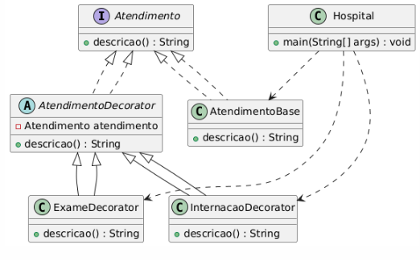

## Motivação

O sistema hospitalar precisa oferecer um atendimento flexível, onde diferentes serviços podem ser adicionados a um paciente sem modificar diretamente a estrutura do código.  
Utilizar o **padrão Decorator** permite adicionar funcionalidades, como **exames** e **internação**, de forma modular e extensível, tornando o código mais organizado e fácil de manter.

---

## UML

---

## Participantes

- **Atendimento (Interface):** Define o contrato para um atendimento hospitalar.  
- **AtendimentoBase (Classe concreta):** Implementação padrão de um atendimento simples.  
- **AtendimentoDecorator (Classe abstrata):** Permite adicionar novas funcionalidades ao atendimento.  
- **ExameDecorator (Classe concreta):** Adiciona exames ao atendimento.  
- **InternacaoDecorator (Classe concreta):** Adiciona internação ao atendimento.  
- **Hospital (Classe principal):** Responsável por executar o sistema e demonstrar os atendimentos com diferentes serviços.  
