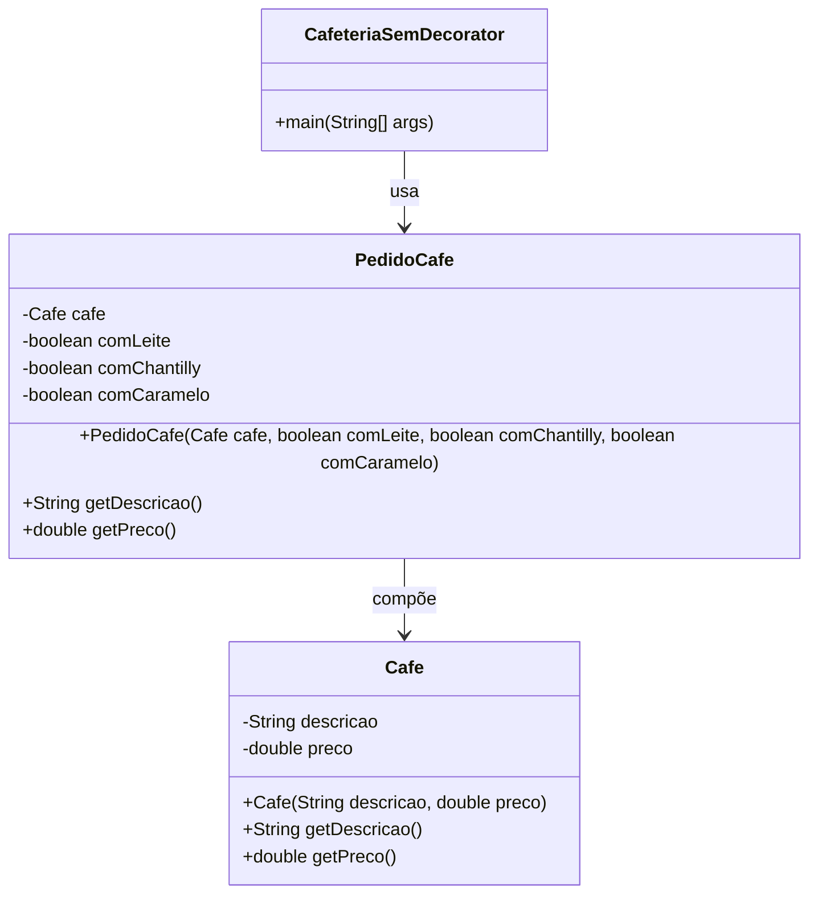
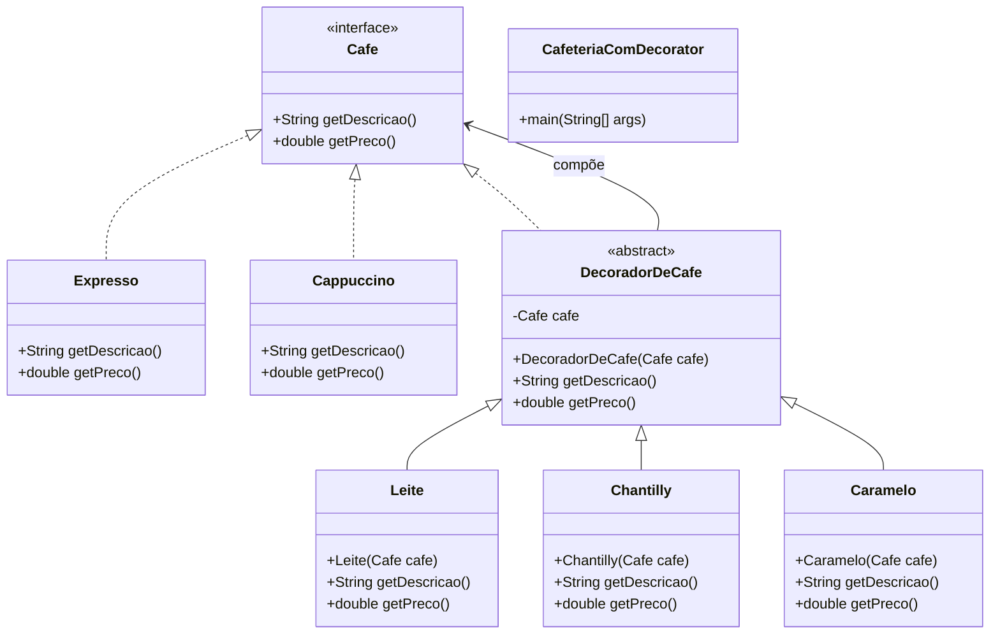

# Decorator

##Intenção
Os decorators permitem adicionar novas responsabilidades a um objeto de forma flexível e dinâmica. Eles oferecem uma alternativa versátil ao uso de subclasses para expandir funcionalidades, evitando a criação excessiva de subclasses.

##Motivação
Uma cafeteria deseja oferecer uma experiência personalizada aos seus clientes, permitindo que eles escolham entre vários tipos de café e adicionem diversos complementos. Os clientes podem querer um café simples, como expresso ou cappuccino, e ainda assim ter a opção de adicionar leite, chantilly ou caramelo.

## UML sem o Padrão Decorator

## UML com o Padrão Decorator

## Explicação do Código
1. **Definimos a interface Cafe, que define os métodos getDescricao() e getPreco().
2. **Implementamos as classes Expresso e Cappuccino, que representam tipos específicos de café com preços e descrições base.
3. **Criamos a classe abstrata DecoradorDeCafe, que encapsula um objeto Cafe e implementa os métodos da interface.
4. **Desenvolvemos os decoradores Leite, Chantilly e Caramelo, que acrescentam funcionalidades ao café sem alterar as classes originais.
5. **O cliente pode mesclar os decoradores, permitindo a personalização flexível dos pedidos, como adicionar leite e chantilly a um cappuccino ou leite, chantilly e caramelo a um expresso.

## Participantes

- **Componente (Cafe):** Interface que define os métodos getDescricao() e getPreco(). É a base para todos os cafés e decorators.
- **Componente Concreto (Expresso, Cappuccino):** Essas classes definem objetos que têm uma descrição e um preço base, aos quais responsabilidades adicionais (como complementos, por exemplo, leite ou chantilly) podem ser atribuídas dinamicamente por meio de decorators.  
- **Decorator (DecoradorDeCafe):** Essa classe permite a delegação de chamadas e serve como base para os decorators concretos.
- **Decoradores Concretos (Leite, Chantilly, Caramelo):** Adicionam seus respectivos complementos à descrição e ao preço do café.  
- **Cliente (Main):** Classe principal que encapsula um café dentro de múltiplos decorators para adicionar funcionalidades. 
